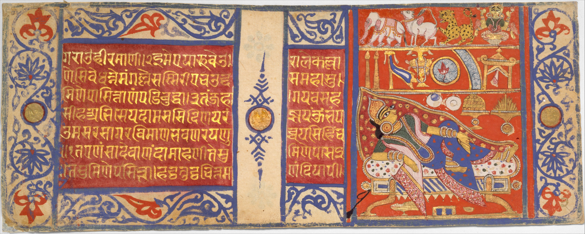

As my love for linguistics has grown, I've begun more seriously studying Sanskrit. 

Unlike many ancient languages, such as Coptic or Sumerian, I've been truly struck by Sanskrit's approachability. Sumerian, for instance, was a language isolate. It had no known relatives and, as Akkadian slowly subsumed the region, Sumerian eventually became an exclusively religious language and soon after, an exclusively dead one. 
 
Our tenuous phonemic reconstructions in conjunction with a woefully misguided pedagogy surrounding ancient language more generally has left us in a world where there are no fluent speakers of this language which ruled the first human empire.

More surprisingly, maybe, is that I don't believe there are any fluent *readers* either. If there are, they exist in stark contrast to the methodology outlined for Assyriologists and Sumerologists in the academic institutions around the world. Transcribe, transliterate, translate. The notion of simply being able to read cuneiform off the clay is quite foreign, and for good reason. 
 
Many ancient Sumerian documents are... less than neat. We of course have beautiful examples such as the Code of Hamurabi, but all together, the Sumerian corpus is more akin to chicken scratch than calligraphy. 
 
Because the Gods of the Sanskrit corpus are still venerated today, because its legends are still told and its plays still performed, there are living communities of people speaking and preserving the language. It has extant counterparts, linguistically and culturally, and those counterparts are eager to offer a kind of pedagogy that puts the exogenous pedagogy of our 19th and 20th century Western anthropologists to shame. We don't need to revive these Gods, they're still here.
 
I've been using [Amarahasa](https://en.amarahasa.com/library/) to improve my literacy, myriad YouTube playlists to improve my listening through immersion, and IRL practice with a dear friend to cement all these linguitic pathways. As they've accumulated in more substantial ways, my reading list has only grown and grown. There are so many great works of Sanskrit literature, and so little time to read them.
 
Like with all great works, though, translations are often fraught with controversy. This controversy paired with a desire to deepen my relationship with the original texts brought me to some of my first encounters with the manuscripts themselves.
 

 
Ever since I stumbled upon this image of a 15th century Jain manuscript, I've been possessed by the compulsion to read one. Unfortunately, I've not been able to find the other folios in this manuscript, but you can view the front and back [here](https://www.metmuseum.org/art/collection/search/37788).
 
Sumerian conditioned me to expect most source documents would be illegible to amateurs like myself. And yet here is some of the most beautiful devanagari calligraphy I've ever seen, scrawled out in gold leaf and lapis lazuli, over 500 years ago. 
 
Ancient peoples, unsurprisingly, had diverse means of organizing their texts. This information is included among that which has not been forgotten, instead being updated for the internet age in ways that make it more accessible than ever. 
See *[How to Read A Jain Manuscript](https://jainpedia.org/resources/how-to-read-a-jain-manuscript/)* for more info here.
 
All these resources have had me so excited, I had to hunt down a potential manuscript to bite into. Finally, I found a [complete work](https://asia.si.edu/explore-art-culture/collections/search/edanmdm:fsg_S1985.2.1-133/) through the Smithsonian Institution. That said, it was being distributed in huge image files with no compression and no way to view the images as a total page, pdf, or sequence. So, I downloaded them all, created a PDF, compressed it, and [uploaded it to Archive.org](https://archive.org/details/kalpasutra_kalakacharyakatha).
 
Hopefully, I'll be able to update this article as I expand my knowledge of Sanskrit and develop critical relationships with these documents. Till then, back to studying!
