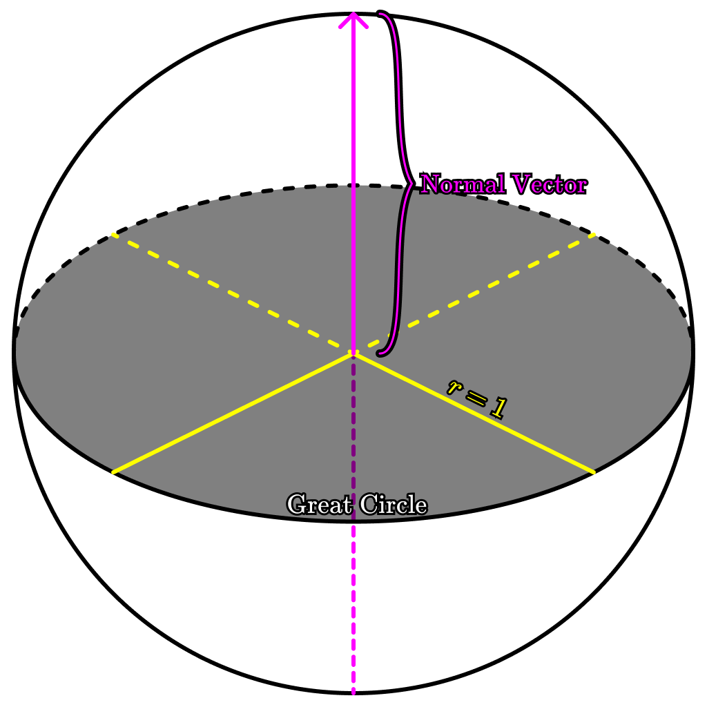

import Red from "@components/colors/Red.astro";
import Orange from "@components/colors/Orange.astro";
import Yellow from "@components/colors/Yellow.astro";
import Green from "@components/colors/Green.astro";
import Blue from "@components/colors/Blue.astro";
import Purple from "@components/colors/Purple.astro";
import Pink from "@components/colors/Pink.astro";
import Collapsible from "@components/Collapsible.astro";

I love you $E=mc^2$ omg

$$E=mc^2$$

This article is targeted towards an audience that wants to deeply understand how real world Astronomy directly results in the divinatory information read by Astrologers around the globe. This is primarily presented in a mathematical and conceptual framework, but some components require pseudocode to be understood in their modern praxis. 
 
As part of my creation of the IOS App Familiar Spirit, I created an Astronomy / Astrology math library from scratch in Swift. Doing so took a great deal of research, conceptualization, and code. The fruits of that labor are condensed for you here.
 
No prior knowledge of Astronomy is assumed, so this article is very verbose. I encourage you to digest it in parts, even taking your own notes. 
 
Great inspiration in diagramming has been pulled from The Elements of House Division by Ralph William Holden, a masterful work of Astrology math that has been largely forgotten by contemporary Astrologers. I was only able to read it by visiting the Library of Congress, but it clarified some of the higher complexity <Pink>House Division</Pink> mathematics. The Astrological community owes him a great debt for preserving this knowledge.
 

 
<Collapsible>
    <Red slot="title"><h4>Fundamental Building Blocks</h4></Red>
    

        This section will provide concepts that are essential to a complete understanding of all subsequent sections. Do not skip these concepts if you have any plans to implement Astrology Math in a codebase of your own.
        <Collapsible>
            <Red slot="title"><h5>AstroAngle</h5></Red>
            

                Let us define an <Red>AstroAngle</Red> as an angle that is represented internally in one of the following forms. 
                <Collapsible>
                    <Red slot="title"><h6>$\rm degrees$</h6></Red>
                    

                        Familiar to anyone who has taken Geometry, <Red>$\rm degrees$</Red> divide the circle into $360$ even components. A <Red>$\rm degree$</Red> is denoted using the <Red>$\degree$</Red> symbol. The result is a system that lends itself to highly intuitive angle math, an innovation that we can thank the Sumerians for.
                         
                        A '<Red>$\rm minute$</Red>' is $\frac{1}{60} th$ of a <Red>$\rm degree$</Red>. It is denoted using the <Red>'</Red> symbol.
                         
                        A '<Red>$\rm second$</Red>' is $\frac{1}{60} th$ of a <Red>$\rm minute$</Red>. It is denoted using the <Red>''</Red> symbol.
                         
                        <Red>Degree</Red>-based <Red>AstroAngles</Red> can be initialized in the form <Red>$\mathrm{AstroAngle(degrees}: x)$</Red> or the form <Red>$\mathrm{AstroAngle(degrees}: x, \mathrm{minutes}: y, \mathrm{seconds}: z)$</Red>.
                    

                </Collapsible>
                <Collapsible>
                    <Red slot="title"><h6>$\rm hours$</h6></Red>
                    

                        Unlike <Red>$\rm degrees$</Red>, <Red>$\rm hours$</Red> divide the circle into $24$ even components. An <Red>$\rm hour$</Red> is denoted using the symbol <Red>$\rm h$</Red>. The result is that <Red>$\rm 1h = 15\degree$</Red>. While less common than <Red>$\rm degrees$</Red>, it is still used widely in Astronomy by convention.
                         
                        A '<Red>$\rm minute$</Red>' is $\frac{1}{60} th$ of an <Red>$\rm hour$</Red>. It is denoted using the <Red>$m$</Red> symbol.
                         
                        A '<Red>$\rm second$</Red>' is $\frac{1}{60} th$ of an <Red>$\rm minute$</Red>. It is denoted using the <Red>$s$</Red> symbol.
                    

                </Collapsible>
                Note that traditionally, we do not employ radians in our computations. If you are attempting to implement this math in software, that might change, but fundamentally you must also be able to work with these value forms.
                 
                Let us also define a method <Red>$\rm bound$</Red> which will modify a given value to keep it within the expected range of an <Red>AstroAngle</Red>. While extremely simple, this method is also extremely useful in performing Astronomy math.
                 
                <Collapsible>
                    <Red slot="title"><h6>$\mathrm{bound}(\theta)$</h6></Red>
                    

                        $$
                            \begin{aligned}
                            \algorithm{1}{Bound} \\
                            \theta \gets \{AstroAngle\} \\
                            \while{\theta \lt 360\degree} \\
                            \theta \gets \theta + 360\degree \\
                            \while{\theta \gt 360\degree} \\
                            \theta \gets \theta - 360\degree \\
                            \end{aligned}
                        $$
                    

                </Collapsible>
            

        </Collapsible>
        <Collapsible>
            <Red slot="title"><h5>Great Circles & Normal Vectors</h5></Red>
            

                There is a great deal of spherical trigonometry in the matter of Astrology math. 
                 
                Two concepts fundamental to an understanding of that trigonometry are the notions of <Red>Great Circles</Red> and <Red>Normal Vectors</Red>.
                <Red>Great Circles</Red> are any circles that, when drawn on a sphere, bisect that sphere into two equal halves.
                <Red>Normal Vectors</Red> have a more nuanced meaning in other fields such as computer graphics and game design, but for our purpose they can be thought of simply as Unit Vectors which are perpendicular to a given <Red>Great Circle</Red>.
                The reason we care deeply about these concepts is because our <Orange>Coordinate Systems</Orange> primarily employ <Red>Great Circles</Red> as their reference points.
                Additionally, by taking the [Cross Product](https://en.wikipedia.org/wiki/Cross_product) of any two <Red>Normal Vectors</Red>, we can find the intersections of the <Red>Great Circles</Red> they correspond to. This is an essential methodology in the matter of House Division.
                
            

        </Collapsible>
        <Collapsible>
            <Red slot="title"><h5>Ecliptic Plane & Zodiacal Signs</h5></Red>
            

                Let me also note that traditionally, the Horizon is made to appear completely horizontal on a Chart, but this convention is being broken here to showcase that the angle of the Horizon does not need to match the angle with which the Earth faces the Sun.
                 
                The <Red>Zodiacal Signs</Red> lie on the <Red>Ecliptic Plane</Red>, and simply divides it as a circle into twelve equal sections of 30<Red>$\degree$</Red> each.
                 
                The locations of planets seen plotted on a traditional horoscope do not showcase planetary location through Heliocentric orbit, but instead apparent location from a Geocentric perspective.
                 
                Here, I illustrate an example chart and the solar system in the same image such that the relationship between the the <Red>Ecliptic Plane</Red> and the Astrological Chart can be understood.
                 
                Let me also note that traditionally, the Horizon is made to appear completely horizontal on a Chart, but this convention is being broken here to showcase that the angle of the Horizon does not need to match the angle with which the Earth faces the Sun.
                
            

        </Collapsible>
        <Collapsible>
            <Red slot="title"><h5>Solstices & Equinoxes</h5></Red>
        </Collapsible>
        <Collapsible>
            <Red slot="title"><h5>The Celestial Sphere & Diurnal Motion</h5></Red>
        </Collapsible>
        <Collapsible>
            <Red slot="title"><h5>Precession</h5></Red>
        </Collapsible>
        <Collapsible>
            <Red slot="title"><h5>Sidereal Days & Solar Days</h5></Red>
        </Collapsible>
    

</Collapsible>
<Collapsible>
    <Orange slot="title"><h4>Coordinate Systems</h4></Orange>
    

        <Collapsible>
            <Orange slot="title"><h5>Geographic</h5></Orange>
        </Collapsible>
        <Collapsible>
            <Orange slot="title"><h5>Heliocentric Ecliptic</h5></Orange>
        </Collapsible>
        <Collapsible>
            <Orange slot="title"><h5>Geocentric Ecliptic</h5></Orange>
        </Collapsible>
        <Collapsible>
            <Orange slot="title"><h5>Equatorial</h5></Orange>
        </Collapsible>
        <Collapsible>
            <Orange slot="title"><h5>Horizontal</h5></Orange>
        </Collapsible>
    

</Collapsible>

<Collapsible>
    <Yellow slot="title"><h4>Observers and Time</h4></Yellow>
    

        Meow, meow; $J$
        <Collapsible>
            <Yellow slot="title"><h5>Greenwich Mean Time (GMT) $(\mathcal{G})$</h5></Yellow>
        </Collapsible>
        <Collapsible>
            <Yellow slot="title"><h5>Julian Day $(J)$</h5></Yellow>
        </Collapsible>
        <Collapsible>
            <Yellow slot="title"><h5>Greenwich Mean Sidereal Time (GMST) $(\theta_G)$</h5></Yellow>
        </Collapsible>
        <Collapsible>
            <Yellow slot="title"><h5>Local Mean Sidereal Time (LMST) $(\theta_L)$</h5></Yellow>
        </Collapsible>
    

</Collapsible>

<Collapsible>
    <Green slot="title"><h4>Coordinate Conversion</h4></Green>
    

        <Collapsible>
            <Green slot="title"><h5>Heliocentric Ecliptic $\rightarrow$ Geocentric Ecliptic</h5></Green>
        </Collapsible>
        <Collapsible>
            <Green slot="title"><h5>Geocentric Ecliptic $\leftrightarrow$ Equatorial</h5></Green>
        </Collapsible>
        <Collapsible>
            <Green slot="title"><h5>Equatorial $\leftrightarrow$ Horizontal</h5></Green>
        </Collapsible>

    

</Collapsible>

<Collapsible>
    <Blue slot="title"><h4>Orbits</h4></Blue>
    

    

</Collapsible>

<Collapsible>
    <Purple slot="title"><h4>Planetary Placements</h4></Purple>
    

        <Collapsible>
            <Purple slot="title"><h5>Heliocentric</h5></Purple>
        </Collapsible>
        <Collapsible>
            <Purple slot="title"><h5>Perturbation Adjustment</h5></Purple>
        </Collapsible>
        <Collapsible>
            <Purple slot="title"><h5>Geocentric</h5></Purple>
        </Collapsible>
        <Collapsible>
            <Purple slot="title"><h5>Retrograde Motion</h5></Purple>
        </Collapsible>
    

</Collapsible>

<Collapsible>
    <Pink slot="title"><h4>House Systems</h4></Pink>
    

        <Collapsible>
            <Pink slot="title"><h5>Cardinal Points</h5></Pink>
        </Collapsible>
        <Collapsible>
            <Pink slot="title"><h5>Ecliptic Systems</h5></Pink>
        </Collapsible>
        <Collapsible>
            <Pink slot="title"><h5>Space Systems</h5></Pink>
        </Collapsible>
        <Collapsible>
            <Pink slot="title"><h5>Time Systems</h5></Pink>
        </Collapsible>
    

</Collapsible>

<Red>Meow</Red>
<Orange>Meow</Orange>
<Yellow>Meow</Yellow>
<Green>Meow</Green>
<Blue>Meow</Blue>
<Purple>Meow</Purple>
<Pink>Meow</Pink>

